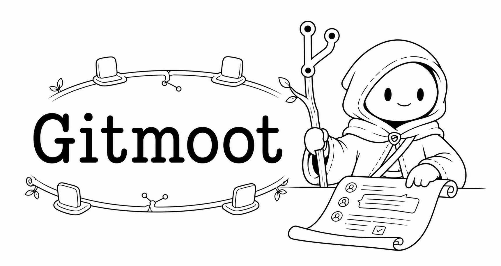
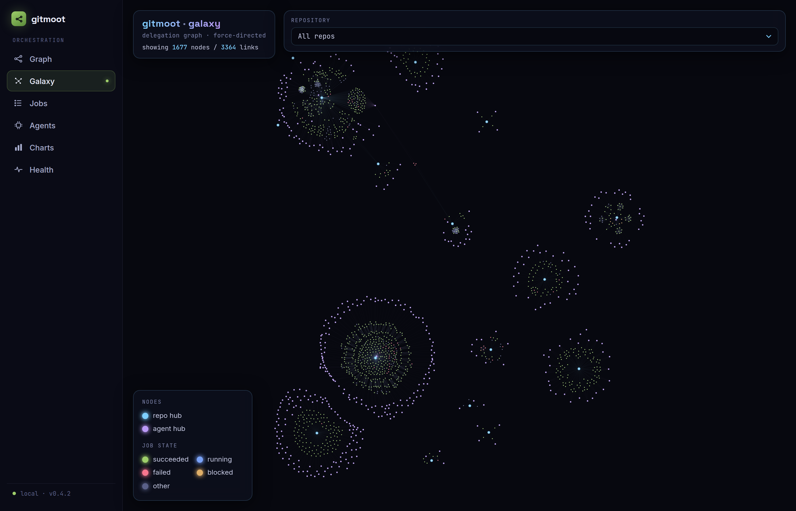
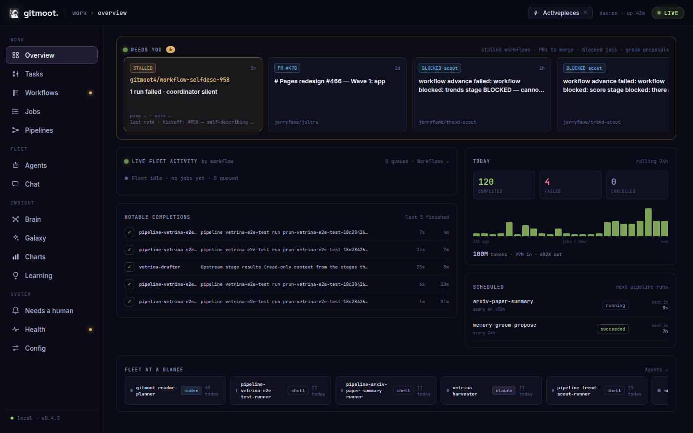
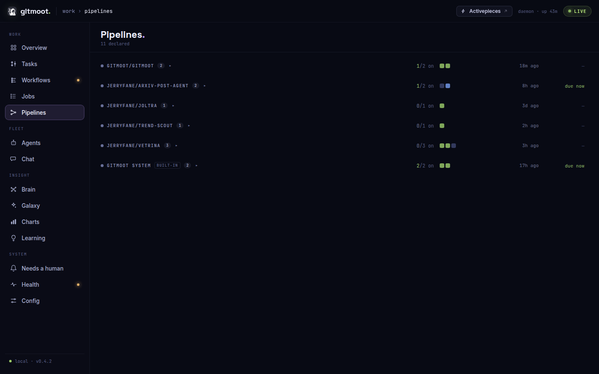
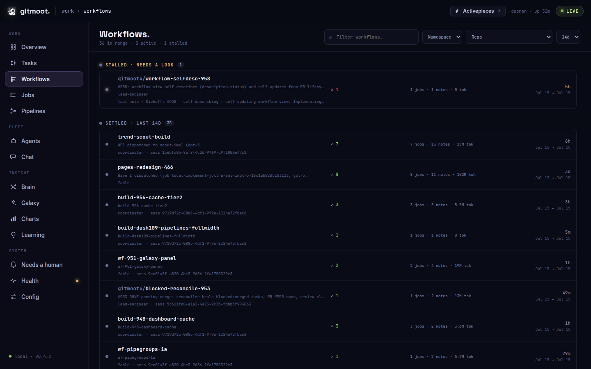
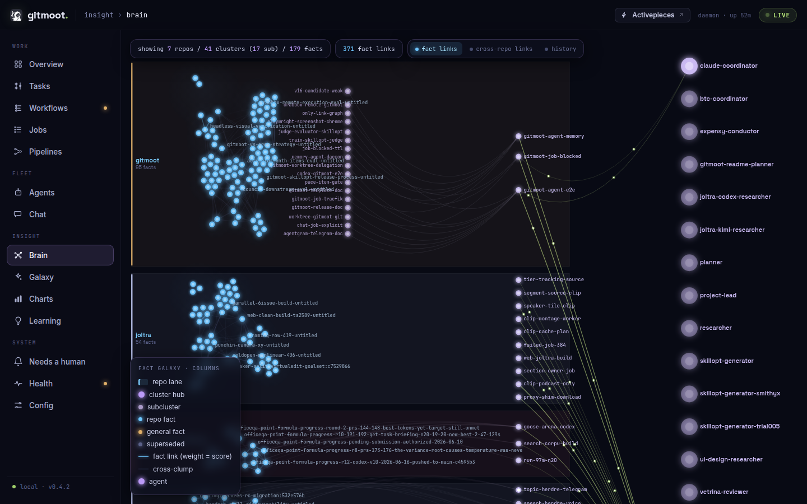
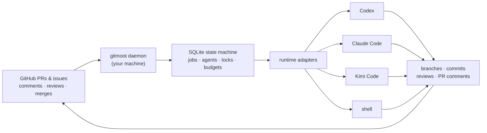

<p align="center">
  
</p>

<div align="center">

[](./LICENSE)
[](https://github.com/gitmoot/gitmoot/releases)
[](https://github.com/gitmoot/gitmoot/actions/workflows/ci.yml)
[](https://gitmoot.io/docs/intro)
[](https://gitmoot.io/llms.txt)
[](./go.mod)

**Local-first multi-agent coordination for GitHub pull request workflows.**

</div>


## Built with Codex (OpenAI Build Week 2026)

**The Build Week submission is one feature of this repo: [Gitmoot Pipelines](https://gitmoot.io/docs/workflows/pipelines-workflow)**,
agent graphs saved as yaml files that you can rerun, inspect, share, and expose as a typed
service API with verifiable receipts. Start there if you came from Devpost. Demo video: <https://www.youtube.com/watch?v=oiX8OiXAVrM>. The repo keeps evolving after the
hackathon; the exact tree as submitted on July 21 is frozen at the
[`buildweek-2026-submission` tag](https://github.com/gitmoot/gitmoot/tree/buildweek-2026-submission). Submission assets, the Codex session table, and a
verbatim proof receipt live in [`buildweek-2026/`](buildweek-2026/) (temporary folder,
removed after judging).

The Pipelines-as-a-Service layer (`pipeline expose` / `serve`, typed input firewall, public
receipts) and the proof spine were implemented by **Codex running gpt-5.6-sol**, coordinated
through gitmoot itself. Gitmoot mints receipts for its own implementation jobs, so the
collaboration is verifiable: Codex session `019f6e86-fdf2-78f1-8f6a-7c5e0f948340`, proof
manifest `sha256:78b3ab08...` (`gitmoot proof` reproduces it offline). The Build Week demo
pipeline lives at [gitmoot/appkit-demo](https://github.com/gitmoot/appkit-demo), and its runs
are public at <https://gitmoot.themartian.app/pipelines/appkit-pro>.

## Our Vision

AI agents can already write code, review diffs, and run your tools. What they can't do is coordinate across sessions, runtimes, and days without losing the one thing software teams actually trust: **the pull request audit trail**.

Gitmoot makes the repository and its PRs the shared surface where humans and agents work together. It runs entirely on **your machine**: one static binary, one local SQLite file, zero runtime dependencies, no cloud control plane. PR comments become agent tasks; agent work flows back as branches, commits, reviews, and merges, every step visible where your team already looks.

And it is built for the hard part: **unattended operation**. Locks, budgets, crash recovery, and graceful degradation are first-class, because an orchestrator you have to babysit is just a slower way of doing the work yourself.

## Key Features

### Orchestrate sub-agents across different runtimes

A coordinator agent returns a validated `delegations[]` DAG; Gitmoot dispatches the children in parallel or dependency order, then reconvenes one continuation to synthesize the results. The coordinator and its workers do not need to share a runtime: a Claude conductor can fan work out to Codex implementers, a Kimi reviewer, and a deterministic shell checker in the same tree. Ephemeral workers spawn mid-orchestration with no pre-registration, and trees recurse up to depth 8, bounded by per-root job, wall-clock, token, and dollar budgets plus loop detection. When any bound trips, a graceful finalize continuation still delivers a best-effort result instead of dropping work.

```sh
gitmoot orchestrate lead "Review PR #123 from three independent angles." --repo owner/repo --recipe review-panel
```

<p align="center">
  
</p>

### Create custom agents in minutes

An agent is a named identity with a role, capabilities, a runtime, and a versioned prompt template. Draft a template, edit it, bind it to an agent; or capture the workflow of your current Codex or Claude chat into a reusable template without retyping anything. Templates are versioned, snapshotted into every job, diffable, pinnable (`--template reviewer@v1`), and shareable through a GitHub repo with `template publish` and `template pull`.

```sh
gitmoot agent template draft frontend-reviewer --output agents/frontend-reviewer.md
gitmoot agent template add frontend-reviewer --file agents/frontend-reviewer.md
gitmoot agent start frontend-reviewer --runtime codex --repo owner/repo --template frontend-reviewer --effort high
```

Codex agents can set a default reasoning effort with `--effort`, and individual
jobs can override it with the same flag. Gitmoot forwards the free-form value as
`-c model_reasoning_effort=<value>`; Claude and Kimi ignore it.

### Agents that evolve themselves with SkillOpt

The [SkillOpt](https://github.com/gitmoot/gitmoot-skillopt) loop turns real usage into better agents: job traces feed an optimizer, candidate prompt versions run behind a canary with automatic rollback, and promotion stays a human decision. Blind A/B review, ranked exploration, and GitHub-based feedback collection are built in, so your review agent from last month keeps getting sharper without hand-tuning prompts.

### Built for unattended runs

Checkout, branch, and runtime-session locks; per-root token and dollar budgets; boot-id crash recovery that reclaims jobs and locks the moment a reboot proves their owner dead; `task recover` for salvaging a dead implementer's half-finished work; `job kill` for whole delegation trees; paused trees that @-mention you on the PR with the exact resume command. Overnight is the normal case, not the demo case.

### Driven from GitHub, visible everywhere

Route work with `/gitmoot <agent> <action>` or `@agent` mentions on PRs and issues ([comment grammar](https://gitmoot.io/docs/workflows/pr-comment-workflow)). Follow it live in the PR thread, the terminal cockpit (`gitmoot dashboard`), or the [read-only web dashboard](https://gitmoot.io/docs/dashboard/overview): jobs, agents, delegation graphs, token and cost charts.

<table>
  <tr>
    <td width="50%"></td>
    <td width="50%"></td>
  </tr>
  <tr>
    <td width="50%"></td>
    <td width="50%"></td>
  </tr>
</table>

## How It Works



The core primitive is a runtime-neutral Gitmoot agent. Codex, Claude Code, and Kimi Code are adapters behind one internal contract; local SQLite is the source of truth, and GitHub is the collaboration surface.

Gitmoot is also agent-native from the first minute: you don't have to install it yourself. Paste this into your coding agent and let it do the setup:

```text
Install gitmoot on this machine (curl -fsSL https://gitmoot.io/install.sh | sh),
then set it up for this repo with `gitmoot setup` and verify with `gitmoot doctor`.
The docs index for agents is https://gitmoot.io/llms.txt
```

## Quick Start

Three steps to a working agent:

```sh
# 1. Install (single static binary)
curl -fsSL https://gitmoot.io/install.sh | sh

# 2. Register the repo, subscribe an agent, start the daemon: one command
gitmoot setup --repo owner/repo --path . --agent helper --runtime claude --session last --start-daemon

# 3. Put it to work from any PR or issue
#    /gitmoot helper ask What is blocking this PR?
```

| Runtime | Flag | Notes |
|---|---|---|
| Codex | `--runtime codex` | plans, implements, reviews |
| Claude Code | `--runtime claude` | `--session last` reuses your login |
| Kimi Code | `--runtime kimi` | `kimi login` first, then restart the daemon |
| Shell | `--runtime shell` | deterministic command runtime: CI-style jobs, no LLM |

Your agent can also drive Gitmoot on your behalf: `gitmoot plugin install claude` (or `codex`) packages the Gitmoot Agent Skill into the runtime's plugin system, so your agent discovers the commands, registers repos, subscribes other agents, and launches orchestrations for you. Agents start from the [llms.txt index](https://gitmoot.io/llms.txt).

Full setup, daemon operation, PR-comment grammar, and parallelism: **[Install](https://gitmoot.io/docs/getting-started/install)** · **[Quick Start](https://gitmoot.io/docs/getting-started/quick-start)** · **[CLI reference](https://gitmoot.io/docs/reference/cli)**

## Use Cases

Built-in coordinator recipes turn the Orchestra pattern into one command:

- **Review panel**: a panel of diverse-lens reviewers over a PR, synthesized into one verdict.
  `gitmoot orchestrate lead "Review PR #123." --repo owner/repo --recipe review-panel`
- **Decompose and verify**: split a task into parallel file-disjoint legs plus a verify step that depends on all of them.
  `gitmoot orchestrate lead "Implement the export feature." --repo owner/repo --recipe decompose-and-verify`
- **Producer vs. checker**: one implementation leg, one independent read-only verification on a different runtime.
  `gitmoot orchestrate lead "Implement the rate limiter and prove it works." --repo owner/repo --recipe verifier`

More workflows: **[coordinator recipes](https://gitmoot.io/docs/workflows/coordinator-recipes-workflow)** · [template capture](https://gitmoot.io/docs/workflows/template-capture-workflow) · [heartbeat schedules](https://gitmoot.io/docs/workflows/heartbeat-schedules-workflow) · [SkillOpt training](https://gitmoot.io/docs/workflows/skillopt-train-workflow) · [events webhook](https://gitmoot.io/docs/reference/event-stream).

## What's Next

The roadmap lives in the open: follow the [open issues](https://github.com/gitmoot/gitmoot/issues) to see what's coming and weigh in on what matters to you.

## Documentation

- **[Hosted docs](https://gitmoot.io/docs/intro)**: guides, concepts, reference
- **[LLM index](https://gitmoot.io/llms.txt)**: machine-readable docs index; agents start here (full context: [llms-full.txt](https://gitmoot.io/llms-full.txt))
- [Agent Skill package](skills/gitmoot/SKILL.md) · [CLI reference](skills/gitmoot/references/CLI.md): in-repo, versioned with the code
- [Concepts](https://gitmoot.io/docs/concepts/local-first-coordination) · [Result contract & delegation bounds](https://gitmoot.io/docs/reference/result-contract) · [Dashboard](https://gitmoot.io/docs/dashboard/overview) · [Parallel jobs](https://gitmoot.io/docs/workflows/parallel-jobs-workflow) · [Plugins](https://gitmoot.io/docs/plugins/codex-claude) · [Troubleshooting](https://gitmoot.io/docs/operations/troubleshooting)

## Status And V1 Limits

Local-only by design: no hosted dashboard, GitHub App identity, cloud runner, or webhook receiver (the daemon polls). GitHub comments are authored by your authenticated `gh` user; agent identity appears in the comment body. Local SQLite remains the workflow source of truth.

## Contributing

Gitmoot is early and moving fast. Keep changes scoped, preserve local-first behavior, add focused tests, and remember: **docs ship with code**. Every user-facing change updates the skill, site, and llms surfaces in the same PR. See [AGENTS.md](AGENTS.md) for the full engineering contract (verify gates, conventions, footguns).

```sh
go test ./...
go vet ./...
```

GitHub Actions enforces build, vet, and tests, plus the race detector on the core packages, on every push to `main` and every pull request.

<a href="https://github.com/gitmoot/gitmoot/graphs/contributors">
  
</a>

## Acknowledgements

Gitmoot stands on the runtimes it coordinates: [Codex](https://github.com/openai/codex), [Claude Code](https://claude.com/claude-code), and [Kimi Code](https://github.com/MoonshotAI), and on [modernc.org/sqlite](https://pkg.go.dev/modernc.org/sqlite), which keeps the single-binary, zero-cgo promise honest. Thanks to the downstream builders stress-testing Gitmoot in the wild, including the [council](https://github.com/plotarmordev/council) multi-model quorum system, whose bug reports and PRs make the unattended path real.

## License

Gitmoot is open source under the [Apache License 2.0](./LICENSE). See [NOTICE](./NOTICE) for attribution details.
