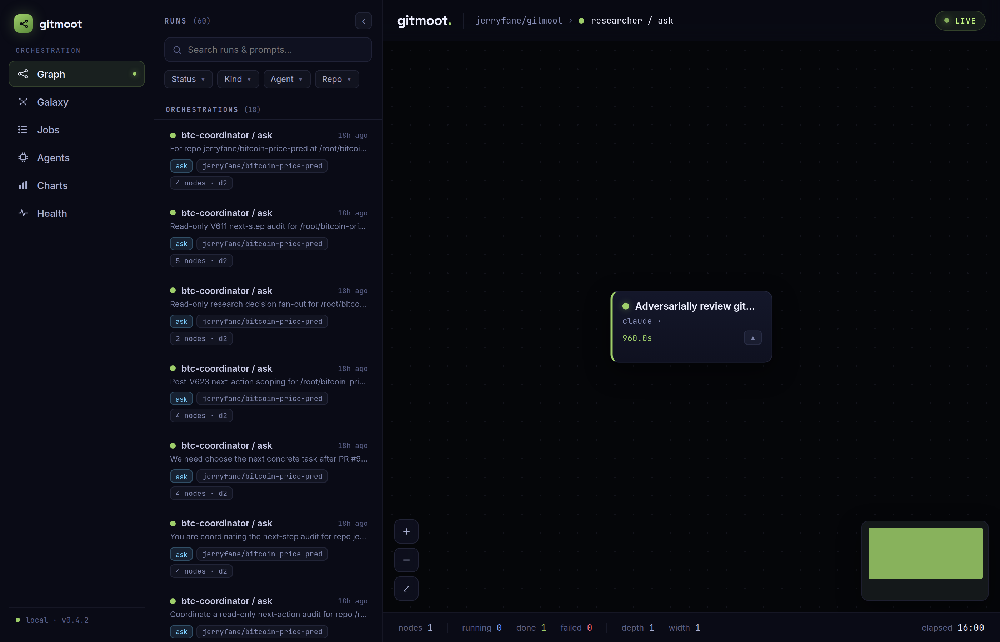
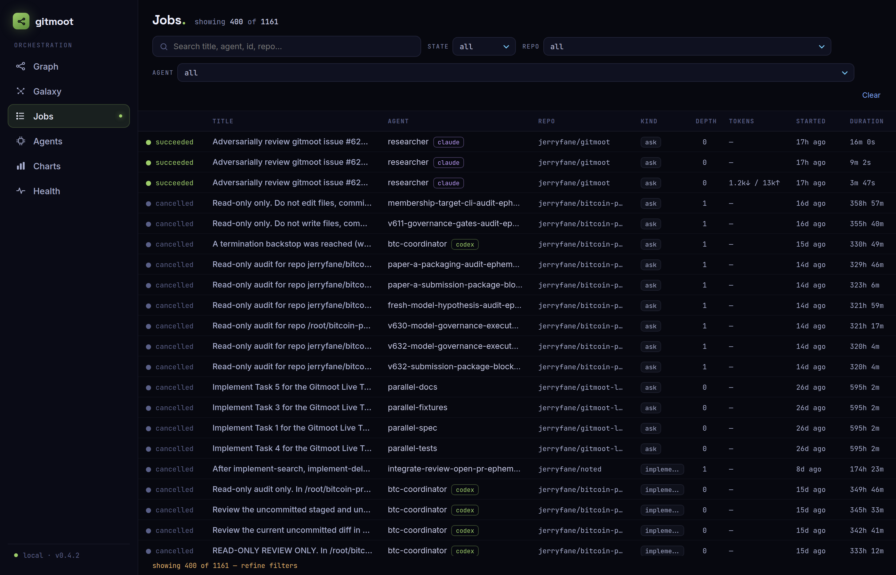
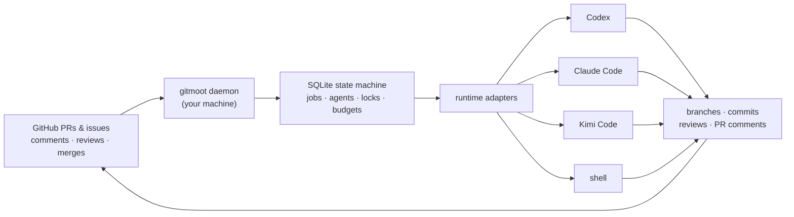

<p align="center">
  
</p>

<div align="center">

[](./LICENSE)
[](https://github.com/jerryfane/gitmoot/releases)
[](https://github.com/jerryfane/gitmoot/actions/workflows/ci.yml)
[](https://gitmoot.io/docs/intro)
[](https://gitmoot.io/llms.txt)
[](./go.mod)

**Local-first multi-agent coordination for GitHub pull request workflows.**

</div>

## Our Vision

AI agents can already write code, review diffs, and run your tools. What they can't do is coordinate — across sessions, runtimes, and days — without losing the one thing software teams actually trust: **the pull request audit trail**.

Gitmoot makes the repository and its PRs the shared surface where humans and agents work together. It runs entirely on **your machine**: one static binary, one local SQLite file, zero runtime dependencies, no cloud control plane. PR comments become agent tasks; agent work flows back as branches, commits, reviews, and merges — every step visible where your team already looks.

And it is built for the hard part: **unattended operation**. Locks, budgets, crash recovery, and graceful degradation are first-class, because an orchestrator you have to babysit is just a slower way of doing the work yourself.

## Key Features

### 🎼 Orchestra — recursive multi-agent delegation

A coordinator agent returns a validated `delegations[]` DAG; Gitmoot dispatches the children (parallel or dependency-ordered, across different runtimes), then reconvenes one continuation to synthesize the results. Trees recurse up to depth 8 — bounded by a per-root job budget, wall-clock budget, width cap, and loop detection. When any bound trips, a graceful finalize continuation still delivers a best-effort result instead of dropping work.

```sh
gitmoot orchestrate lead "Review PR #123 from three independent angles." --repo owner/repo --recipe review-panel
```

<p align="center">
  
</p>

### 🔌 Runtime-neutral agents

One agent model in front of **Codex, Claude Code, Kimi Code, and a deterministic `shell` adapter** — plus per-job runtime/model overrides and ephemeral throwaway workers spawned mid-orchestration, no pre-registration. Your coordinator can be Claude while its fan-out runs on Codex.

### 🛡️ Built for unattended runs

Checkout, branch, and runtime-session locks; per-root token **and** dollar budgets; boot-id crash recovery that reclaims jobs and locks the moment a reboot proves their owner dead; `task recover` for salvaging a dead implementer's half-finished work; `job kill` for whole delegation trees; paused trees that @-mention you on the PR with the exact resume command. Overnight is the normal case, not the demo case.

### 💬 Driven from GitHub, visible everywhere

Route work with `/gitmoot <agent> <action>` or `@agent` mentions on PRs and issues ([comment grammar](https://gitmoot.io/docs/workflows/pr-comment-workflow)). Follow it live in the PR thread, the terminal cockpit (`gitmoot dashboard`), or the [read-only web dashboard](https://gitmoot.io/docs/dashboard/overview) — jobs, agents, delegation graphs, token/cost charts.

<p align="center">
  
</p>

### 📈 Templates that version — and optimize themselves

Agent prompts are versioned, snapshotted per job, diffable, and shareable through a GitHub repo (`template publish` / `pull`). The **SkillOpt** loop closes the circle: usage traces feed an optimizer, candidates run behind a canary with auto-rollback, and promotion stays a human decision.

## How It Works



The core primitive is a runtime-neutral Gitmoot agent — Codex, Claude Code, and Kimi Code are adapters behind one internal contract. Local SQLite is the source of truth; GitHub is the collaboration surface.

## Quick Start

Three steps to a working agent:

```sh
# 1. Install (single static binary)
curl -fsSL https://gitmoot.io/install.sh | sh

# 2. Register the repo, subscribe an agent, start the daemon — one command
gitmoot setup --repo owner/repo --path . --agent helper --runtime claude --session last --start-daemon

# 3. Put it to work from any PR or issue
#    /gitmoot helper ask What is blocking this PR?
```

| Runtime | Flag | Notes |
|---|---|---|
| Codex | `--runtime codex` | plans, implements, reviews |
| Claude Code | `--runtime claude` | `--session last` reuses your login |
| Kimi Code | `--runtime kimi` | `kimi login` first, then restart the daemon |
| Shell | `--runtime shell` | deterministic command runtime — CI-style jobs, no LLM |

👉 Full setup, daemon operation, PR-comment grammar, and parallelism: **[Install](https://gitmoot.io/docs/getting-started/install)** · **[Quick Start](https://gitmoot.io/docs/getting-started/quick-start)** · **[CLI reference](https://gitmoot.io/docs/reference/cli)**

## Use Cases

Built-in coordinator recipes turn the Orchestra pattern into one command:

- **Review panel** — a panel of diverse-lens reviewers over a PR, synthesized into one verdict:
  `gitmoot orchestrate lead "Review PR #123." --repo owner/repo --recipe review-panel`
- **Decompose and verify** — split a task into parallel file-disjoint legs plus a verify step that depends on all of them:
  `gitmoot orchestrate lead "Implement the export feature." --repo owner/repo --recipe decompose-and-verify`
- **Producer vs. checker** — one implementation leg, one independent read-only verification on a *different* runtime:
  `gitmoot orchestrate lead "Implement the rate limiter and prove it works." --repo owner/repo --recipe verifier`

More workflows: **[coordinator recipes](https://gitmoot.io/docs/workflows/coordinator-recipes-workflow)** · [template capture](https://gitmoot.io/docs/workflows/template-capture-workflow) · [heartbeat schedules](https://gitmoot.io/docs/workflows/heartbeat-schedules-workflow) · [SkillOpt training](https://gitmoot.io/docs/workflows/skillopt-train-workflow) · [events webhook](https://gitmoot.io/docs/reference/event-stream).

## What's Next

- 🧠 **Native agent memory** — per-agent SQLite+FTS5 memory with a repo tier and a general tier ([#626](https://github.com/jerryfane/gitmoot/issues/626))
- ⚖️ **Risk-tiered adaptive review** — cheap review for routine PRs, adversarial multi-lens quorum for high-risk changes ([#650](https://github.com/jerryfane/gitmoot/issues/650))
- 🧭 **Execution-grounded routing** — pick runtime/model per job from real track records, not vibes ([#530](https://github.com/jerryfane/gitmoot/issues/530))
- ☁️ **Remote execution pilot** — optional off-machine workers behind the same adapter seam ([#410](https://github.com/jerryfane/gitmoot/issues/410))

## Documentation

- **[Hosted docs](https://gitmoot.io/docs/intro)** — guides, concepts, reference
- **[LLM index](https://gitmoot.io/llms.txt)** — machine-readable docs index; agents start here (full context: [llms-full.txt](https://gitmoot.io/llms-full.txt))
- [Agent Skill package](skills/gitmoot/SKILL.md) · [CLI reference](skills/gitmoot/references/CLI.md) — in-repo, versioned with the code
- [Concepts](https://gitmoot.io/docs/concepts/local-first-coordination) · [Result contract & delegation bounds](https://gitmoot.io/docs/reference/result-contract) · [Dashboard](https://gitmoot.io/docs/dashboard/overview) · [Parallel jobs](https://gitmoot.io/docs/workflows/parallel-jobs-workflow) · [Plugins](https://gitmoot.io/docs/plugins/codex-claude) · [Troubleshooting](https://gitmoot.io/docs/operations/troubleshooting)

## Status And V1 Limits

Local-only by design: no hosted dashboard, GitHub App identity, cloud runner, or webhook receiver — the daemon polls. GitHub comments are authored by your authenticated `gh` user; agent identity appears in the comment body. Local SQLite remains the workflow source of truth.

## Contributing

Gitmoot is early and moving fast. Keep changes scoped, preserve local-first behavior, add focused tests, and remember: **docs ship with code** — every user-facing change updates the skill, site, and llms surfaces in the same PR. See [AGENTS.md](AGENTS.md) for the full engineering contract (verify gates, conventions, footguns).

```sh
go test ./...
go vet ./...
```

GitHub Actions enforces build, vet, and tests — plus the race detector on the core packages — on every push to `main` and every pull request.

<a href="https://github.com/jerryfane/gitmoot/graphs/contributors">
  
</a>

## Acknowledgements

Gitmoot stands on the runtimes it coordinates — [Codex](https://github.com/openai/codex), [Claude Code](https://claude.com/claude-code), and [Kimi Code](https://github.com/MoonshotAI) — and on [modernc.org/sqlite](https://pkg.go.dev/modernc.org/sqlite), which keeps the single-binary, zero-cgo promise honest. Thanks to the downstream builders stress-testing Gitmoot in the wild — including the [council](https://github.com/plotarmordev/council) multi-model quorum system — whose bug reports and PRs make the unattended path real.

## License

Gitmoot is open source under the [Apache License 2.0](./LICENSE). See [NOTICE](./NOTICE) for attribution details.

## Star History

<a href="https://www.star-history.com/#jerryfane/gitmoot&Date">
 <picture>
   <source media="(prefers-color-scheme: dark)" srcset="https://api.star-history.com/svg?repos=jerryfane/gitmoot&type=Date&theme=dark" />
   <source media="(prefers-color-scheme: light)" srcset="https://api.star-history.com/svg?repos=jerryfane/gitmoot&type=Date" />
   
 </picture>
</a>
