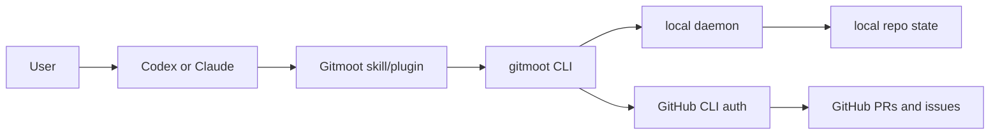

# Install

Install the latest Gitmoot beta with the installer:

```sh
curl -fsSL https://gitmoot.io/install.sh | sh
gitmoot version
```

Gitmoot depends on Git and GitHub CLI for repository and PR workflows:

```sh
git --version
gh --version
gh auth status
```

`gh auth status` must succeed before PR comments, issue comments, review
publication, or merge workflows can work. Do not paste GitHub tokens into
tracked files, issue comments, PR bodies, or logs.

## Ask Your Agent To Install It

For Codex or Claude Code, the easiest path is to ask your active coding agent:

```text
Install Gitmoot as a Codex or Claude skill/plugin in this repo, verify `gitmoot version`, run `gitmoot plugin doctor`, check `gh auth status`, and summarize the next Gitmoot workflow I can use.
```

The plugin or skill is the discovery and guidance surface. The `gitmoot` CLI
and local daemon remain the execution path.



Install runtime plugin guidance when you want Codex or Claude Code to discover
Gitmoot from its plugin system:

```sh
gitmoot plugin install codex
gitmoot plugin install claude
gitmoot plugin doctor
```

## Direct Binary Fallback

If the installer is not appropriate, download the matching release artifact
from GitHub Releases, verify it, make it executable, and move it onto `PATH`.

For Linux:

```sh
sha256sum gitmoot_linux_amd64
chmod +x gitmoot_linux_amd64
mkdir -p ~/.local/bin
mv gitmoot_linux_amd64 ~/.local/bin/gitmoot
command -v gitmoot
gitmoot version
```

For macOS, pick the Apple Silicon or Intel artifact when macOS artifacts are
published:

```sh
shasum -a 256 gitmoot_darwin_arm64
chmod +x gitmoot_darwin_arm64
mkdir -p ~/.local/bin
mv gitmoot_darwin_arm64 ~/.local/bin/gitmoot
command -v gitmoot
gitmoot version
```

For Windows checksum verification:

```powershell
certutil -hashfile gitmoot_windows_amd64.exe SHA256
```

Compare the printed SHA256 with the published checksum before running or moving
the artifact. If the values differ, delete the download and fetch it again from
the release page.

## Update, Roll Back, Or Uninstall

Check for updates and restart the daemon after updating when it is running:

```sh
gitmoot update --check
gitmoot update --restart-daemon
```

For rollback, reinstall a specific versioned release artifact manually and
verify it with `gitmoot version`.

To uninstall the CLI, remove the installed binary path returned by
`command -v gitmoot`. Remove Codex or Claude plugin discovery only if you want
the runtime to stop finding Gitmoot guidance. Do not delete `~/.gitmoot` unless
you intentionally want to remove local Gitmoot state, job history, and config.

## Kimi Code Runtime

To run agents on the Kimi Code runtime (`gitmoot agent start <name> --runtime
kimi`), install the external `kimi` CLI, then authenticate so background jobs
can reuse the session:

```sh
kimi login
gitmoot update --restart-daemon
```

Restart the Gitmoot daemon after `kimi login` so it inherits the logged-in
session. The Kimi runtime is a first-class adapter alongside Codex and Claude
Code; it does not use the `gitmoot plugin install` discovery surface.

## SkillOpt Optimizer

Gitmoot's SkillOpt train workflow invokes a separate Python optimizer only at
optimizer handoff. Install and preflight it before running optimizer-backed
training:

```sh
python3 -m pip install --user pipx
python3 -m pipx ensurepath
pipx install https://github.com/jerryfane/gitmoot-skillopt/releases/download/v0.4.0/gitmoot_skillopt-0.4.0-py3-none-any.whl
gitmoot-skillopt --version
gitmoot-skillopt optimize --help
```

If you install it in a virtualenv, pass the executable with
`gitmoot skillopt train continue --skillopt-bin /path/to/gitmoot-skillopt`.
