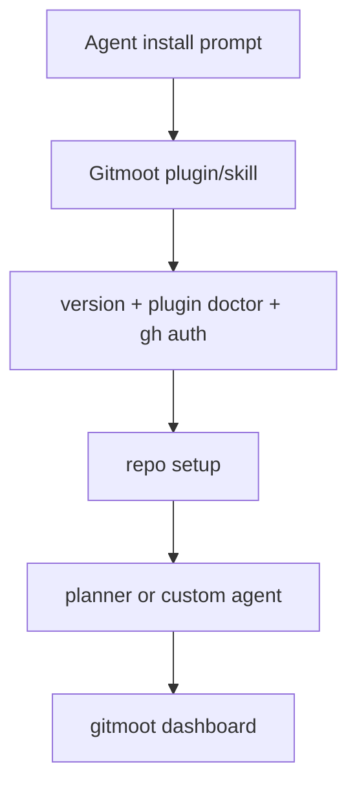

# Quick Start

Run from a project checkout. For Codex, Claude Code, or Kimi Code, start with
the agent path:

```text
Install Gitmoot as a Codex or Claude skill/plugin in this repo, verify `gitmoot version`, run `gitmoot plugin doctor`, check `gh auth status`, and summarize the next Gitmoot workflow I can use.
```

That lets the runtime discover Gitmoot's skill instructions while the local
`gitmoot` CLI remains the execution path.



Manual setup uses the same checks:

```sh
git status --short
git remote -v
gh auth status
gitmoot init
gitmoot repo add owner/repo --path . --poll 30s
gitmoot doctor --repo .
```

Start a Gitmoot-managed planner agent and the background daemon:

```sh
gitmoot agent start project-planner \
  --runtime codex \
  --repo owner/repo \
  --path . \
  --template planner \
  --start-daemon
```

The `--runtime` flag accepts `codex`, `claude`, or `kimi`. To use the Kimi Code
runtime, run `kimi login` first, then restart the Gitmoot daemon so it inherits
the session.

For fast planning in the current Codex or Claude chat, ask the runtime:

```text
Use the Gitmoot planner here. Write the implementation plan.
```

That imports the same `planner` prompt in the current chat. For custom agents,
use the same pattern, for example `Use frontend-reviewer here`.

Ask the registered background planner when you want a queued Gitmoot job:

```sh
gitmoot agent ask project-planner --repo owner/repo --background "Write the implementation plan and goal file."
gitmoot job watch <job-id>
```

Or route work through PR comments:

```text
/gitmoot ask planner Write a task-by-task plan for this PR.
/gitmoot thermo-review review
/gitmoot retry <job-id>
```

Inspect state:

```sh
gitmoot status --repo owner/repo
gitmoot dashboard
gitmoot dashboard --plain
gitmoot job list --repo owner/repo
gitmoot events --repo owner/repo
```

Use `gitmoot agent run` for coordinator delegation that may route to ask,
review, or implement. Use `gitmoot agent ask` for analysis and planning only.
Use `gitmoot dashboard --json` for scripts and noninteractive agent checks.

To kick off an orchestra of agents — a conductor (coordinator) that returns a
`delegations[]` score, players (child agents) that run in parallel or in
dependency order, and a finale (continuation) that reconvenes and synthesizes —
use `gitmoot orchestrate`:

```sh
gitmoot orchestrate project-planner "Plan and split this work across agents." --repo owner/repo
```

`gitmoot orchestrate <agent> "..." [--repo R]` is sugar for
`gitmoot agent run <agent> --background "..."`.
