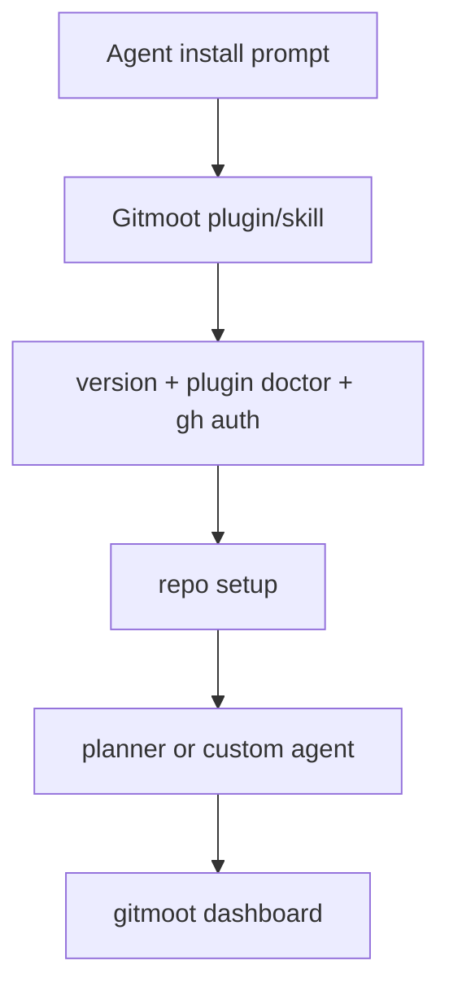

# Quick Start

Run from a project checkout. For Codex, Claude Code, or Kimi Code, start with
the agent path:

```text
Install Gitmoot as a Codex or Claude skill/plugin in this repo, verify `gitmoot version`, run `gitmoot plugin doctor`, check `gh auth status`, and summarize the next Gitmoot workflow I can use.
```

That lets the runtime discover Gitmoot's skill instructions while the local
`gitmoot` CLI remains the execution path.



Manual setup uses the same checks:

```sh
git status --short
git remote -v
gh auth status
gitmoot init
gitmoot repo add owner/repo --path . --poll 30s
gitmoot doctor --repo .
```

`gitmoot init` creates the Gitmoot home (default `~/.gitmoot`; relocate with
`GITMOOT_HOME` or the global `--home` flag); `gitmoot config path` and
`gitmoot config show` locate and print the effective config — see
[Home And Config](../reference/cli.md#home-and-config).

Start a Gitmoot-managed planner agent and the background daemon:

```sh
gitmoot agent start project-planner \
  --runtime codex \
  --repo owner/repo \
  --path . \
  --template planner \
  --start-daemon
```

The `--runtime` flag accepts `codex`, `claude`, `kimi`, or `kimi-cli` (the
opt-in legacy Kimi CLI adapter; choose `kimi` unless you specifically run the
legacy CLI — see [Runtime Adapters](../reference/runtime-adapters.md)). To use
the Kimi Code runtime, run `kimi login` first, then restart the Gitmoot daemon
so it inherits the session.

## Set up a GitHub "tagging" agent

To get an agent that answers `@<agent> ask …` comments on a repo's issues and
PRs in one step, use `gitmoot setup`. It registers the repo, subscribes the
agent, grants it repo access, and (with `--start-daemon`) launches a
tagging-ready daemon:

```sh
gitmoot setup --repo owner/repo --path . \
  --agent helper --runtime claude --session last --start-daemon
```

`gitmoot setup` enables issue-watching by default (`--watch-issues`, on unless
you pass `--watch-issues=false`), so `gitmoot setup --start-daemon` produces a
daemon that actually answers issue tags instead of silently leaving
issue-watching off. After setup it prints a readiness summary: repo registered,
agent access granted, daemon issue-watching state, a daemon runtime-auth note,
and the exact comment to post.

Two things to know when tagging on issues:

- **Run the daemon from a shell that holds the runtime token.** The daemon
  inherits the environment of the shell that (re)started it, so start it where
  the runtime (for example Claude) is authenticated. Verify with
  `gitmoot doctor`, which live-probes the daemon's Claude auth; `gitmoot daemon
  restart` recovers the persisted token even from an unauthenticated shell.
- **On issues only the `ask` action is acted on.** Post the tag as the first
  token of a line:

  ```text
  @helper ask <your question>
  ```

  `review` and `implement` actions apply to PRs; on issues they are ignored.

For fast planning in the current Codex or Claude chat, ask the runtime:

```text
Use the Gitmoot planner here. Write the implementation plan.
```

That imports the same `planner` prompt in the current chat. For custom agents,
use the same pattern, for example `Use frontend-reviewer here`.

Ask the registered background planner when you want a queued Gitmoot job:

```sh
gitmoot agent ask project-planner --repo owner/repo --background "Write the implementation plan and goal file."
gitmoot job watch <job-id>
```

Pin the runtime model for a single job with `--model <name>` (a free-form,
runtime-scoped Codex, Claude Code, or Kimi Code model name):

```sh
gitmoot agent run lead --repo owner/repo --model gpt-5-codex "Implement this task."
```

Or route work through PR comments:

```text
/gitmoot ask planner Write a task-by-task plan for this PR.
/gitmoot thermo-review review
/gitmoot retry <job-id>
```

Inspect state:

```sh
gitmoot status --repo owner/repo
gitmoot dashboard
gitmoot dashboard --plain
gitmoot job list --repo owner/repo
gitmoot events --repo owner/repo
```

Use `gitmoot agent run` for coordinator delegation that may route to ask,
review, or implement. Use `gitmoot agent ask` for analysis and planning only.

On a real terminal, `gitmoot dashboard` launches an interactive TUI cockpit with
pages for Attention, Activity (live orchestras), Trains, Agents, Workers, Jobs,
Locks, Health, and Config (pending prompts live under Attention). Use
`gitmoot dashboard --plain` for a one-shot snapshot, `gitmoot dashboard --json`
for scripts and noninteractive agent checks, and `gitmoot dashboard --web` for
a read-only browser view of a running orchestration.

To kick off an orchestra of agents — a conductor (coordinator) that returns a
`delegations[]` score, players (child agents) that run in parallel or in
dependency order, and a finale (continuation) that reconvenes and synthesizes —
use `gitmoot orchestrate`:

```sh
gitmoot orchestrate project-planner "Plan and split this work across agents." --repo owner/repo
```

`gitmoot orchestrate <agent> "..." [--repo R]` is sugar for
`gitmoot agent run <agent> --background "..."`.
