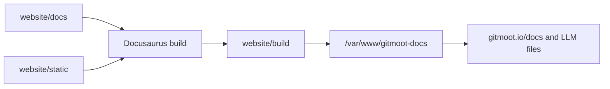

# Docs Deployment

The Gitmoot docs site is a static Docusaurus build, matching the operational
shape used by Entmoot docs.

Build from the repo root:

```sh
cd website
npm install
npm run build
```

The build output is `website/build`. For the current server, deploy it under
the existing `gitmoot.io` host:

```sh
rsync -a --delete build/ /var/www/gitmoot-docs/
```

Nginx serves:

- `https://gitmoot.io/docs/` from `/var/www/gitmoot-docs/`
- `https://gitmoot.io/llms.txt` from the docs build
- `https://gitmoot.io/llms-full.txt` from the docs build

Smoke checks:

```sh
curl -fsS https://gitmoot.io/docs/intro >/dev/null
curl -fsS https://gitmoot.io/docs/reference/cli | rg 'gitmoot dashboard|agent run|interactive'
curl -fsS https://gitmoot.io/docs/workflows/skillopt-train-workflow | rg 'train init|train recover|gitmoot-skillopt'
curl -fsS https://gitmoot.io/docs/release-notes/v0.3.0-beta.1 | rg 'v0.3.0-beta.1|dashboard'
curl -fsS https://gitmoot.io/llms.txt | rg 'SkillOpt|Dashboard|Release Notes'
curl -fsS https://gitmoot.io/llms-full.txt | rg 'skillopt-train-workflow|CLI.md|release-notes'
```



`docs.gitmoot.io` currently resolves to this server but should only be enabled
after the origin TLS certificate and nginx server block explicitly cover that
host.

## Install script (`gitmoot.io/install.sh`)

The one-liner installer (`curl -fsSL https://gitmoot.io/install.sh | sh`) is
served from the **`gitmoot.io` site root**, which on the live server is
**`/var/www/gitmoot.io/`** (`root /var/www/gitmoot.io;` with `location =
/install.sh` in `/etc/nginx/sites-available/gitmoot.io`) — **separate** from the
Docusaurus docs build, which is served under `/docs/` from
`/var/www/gitmoot-docs/` (`baseUrl` is `/docs/`, so `website/static/` files land
under `/docs/`, not `/`). The source of truth is tracked at
**`scripts/install.sh`**; deploy it by copying that file to the site root:

```sh
# from the repo root, on the server:
install -m 0644 scripts/install.sh /var/www/gitmoot.io/install.sh
```

Smoke check after deploy:

```sh
curl -fsSL https://gitmoot.io/install.sh | sh -n -   # downloads + shell-parses
```

The installer downloads the per-OS/arch binary plus `sha256sums.txt` from the
matching GitHub release and verifies the checksum. The release assets
(including `gitmoot_linux_arm64`) and `sha256sums.txt` are produced by
`.github/workflows/release.yml` on release publish.
