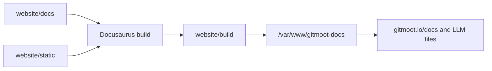

# Docs Deployment

The Gitmoot docs site is a static Docusaurus build, matching the operational
shape used by Entmoot docs.

Build from the repo root:

```sh
cd website
npm install
npm run build
```

The build output is `website/build`. For the current server, deploy it under
the existing `gitmoot.io` host:

```sh
rsync -a --delete build/ /var/www/gitmoot-docs/
```

Nginx serves:

- `https://gitmoot.io/docs/` from `/var/www/gitmoot-docs/`
- `https://gitmoot.io/llms.txt` from the docs build
- `https://gitmoot.io/llms-full.txt` from the docs build

Smoke checks:

```sh
curl -fsS https://gitmoot.io/docs/intro >/dev/null
curl -fsS https://gitmoot.io/docs/reference/cli | rg 'gitmoot dashboard|agent run|interactive'
curl -fsS https://gitmoot.io/docs/workflows/skillopt-train-workflow | rg 'train init|train recover|gitmoot-skillopt'
curl -fsS https://gitmoot.io/docs/release-notes/v0.3.0-beta.1 | rg 'v0.3.0-beta.1|dashboard'
curl -fsS https://gitmoot.io/llms.txt | rg 'SkillOpt|Dashboard|Release Notes'
curl -fsS https://gitmoot.io/llms-full.txt | rg 'skillopt-train-workflow|CLI.md|release-notes'
```



`docs.gitmoot.io` currently resolves to this server but should only be enabled
after the origin TLS certificate and nginx server block explicitly cover that
host.
