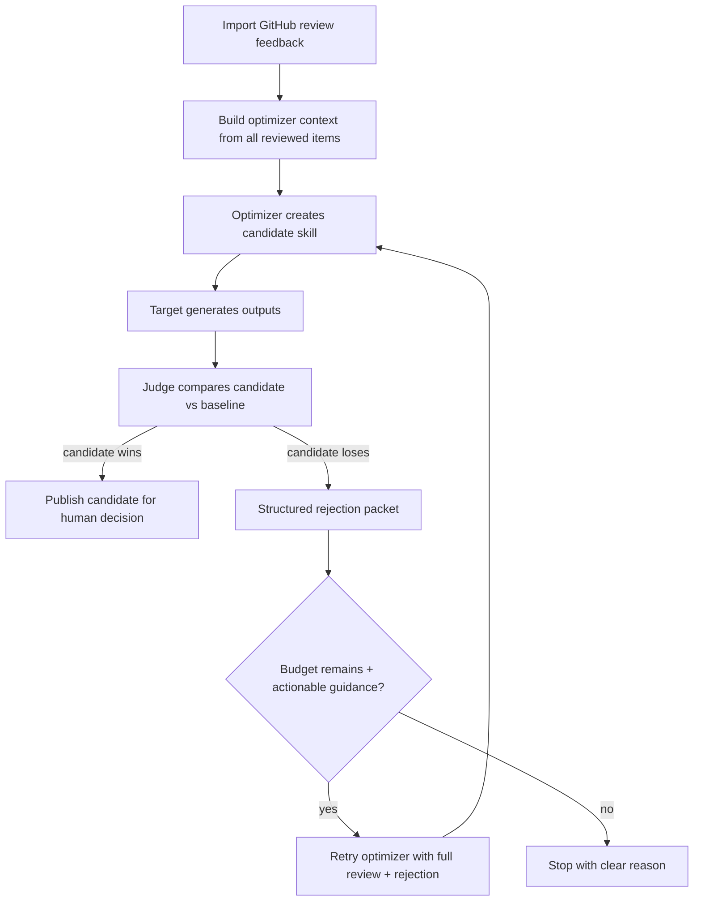

# SkillOpt Train Workflow

Use `gitmoot skillopt train` when a user wants Gitmoot to enforce the full
human-feedback optimization loop for an agent template. Use the lower-level
`gitmoot skillopt review`, `feedback`, `export`, `import`, and `candidate`
commands only for advanced debugging, custom research runs, or recovering one
step of an existing train session.

Train mode keeps Gitmoot as the product/control layer. The external
`gitmoot-skillopt` optimizer remains outside the Go binary and is invoked only
after Gitmoot has collected review items and feedback.

## Session Shape

A train session is the long-lived workflow for one template and request. Each
session has one or more iterations. An iteration has:

- a pinned base template version;
- an eval review run and review items;
- workspace and optional preview repos;
- preferred evaluation gate metadata;
- generated option artifacts;
- imported human feedback;
- an optimizer package and candidate package;
- an optional candidate review issue or PR link;
- a terminal decision: promoted, rejected with a reason, or abandoned.

The next iteration can start only after the prior iteration is promoted,
rejected with a reason, or abandoned. If the prior candidate was promoted, the
promoted candidate version becomes the next base template snapshot. Rejected
candidates never become current silently.

## High-Level Commands

Initialize a reusable training scaffold before expensive training work:

```sh
gitmoot skillopt train init \
  --name planner-train \
  --template planner \
  --review-repo owner/product \
  --task-kind writing \
  --artifact-kind text \
  --preview text-table \
  --mode explore \
  --request "Improve release planning answers from reviewer feedback"
```

`train init` writes `.gitmoot/skillopt/<name>/config.toml`, `task.md`, and a
starter `review-items.yml`. It pins the selected template/version, records the
review repository, applies default generation/evaluator/optimizer settings, and
prints the next `gitmoot skillopt train start --config ...` command. It does not
start optimization, create review items, call models, or publish GitHub issues.

List machine-readable template choices for agents before initializing:

```sh
gitmoot skillopt train init templates --json
```

If required fields are missing in an interactive terminal, `train init` runs a
line-oriented wizard that asks for them one at a time (numbered choices for the
template, with a "Custom file" option, and for the preview style). Each question
is also published as an interactive prompt record, so an agent driving the
wizard in a PTY can answer the current question with `gitmoot interactive answer`
instead of stdin; the wizard blocks on each question until it is answered either
way and then resumes with the next one:

```sh
# in another terminal, while the wizard waits on a question:
gitmoot interactive list --state pending --json
gitmoot interactive answer <prompt-id> <value> --source agent
```

To run the wizard in a visible terminal pane that a human can watch while the
agent answers from its own session, see the
[Herdr composable train init note](https://github.com/jerryfane/gitmoot/blob/main/docs/herdr-composable-train-init.md);
Herdr is an optional frontend, not a Gitmoot dependency.

For agents that prefer answering everything asynchronously in one pass, pass
`--prompts` to store all the prompt requests at once and exit instead of running
the wizard, then answer them and rerun:

```sh
gitmoot skillopt train init --prompts
gitmoot interactive list --state pending --json
gitmoot interactive show <prompt-id> --json
gitmoot interactive answer <prompt-id> <value> --source agent
gitmoot skillopt train init
```

If required fields are missing in non-interactive mode (and `--prompts` is not
set), `train init` exits before creating a scaffold or train session and prints
the missing fields plus a fully flagged example command. Pass `--yes` to force
that fail-fast behavior even on an interactive terminal.

Start from the scaffold, or pass the request, target repo, pinned template, and
item plan directly:

```sh
gitmoot skillopt train start \
  --config .gitmoot/skillopt/planner-train/config.toml \
  --workspace-repo owner/product-workspace \
  --yes

gitmoot skillopt train start \
  --template planner \
  --session planner-train \
  --repo owner/product \
  --workspace-repo owner/product-workspace \
  --preview-repo owner/product-previews \
  --request "Improve release planning answers from reviewer feedback" \
  --items-file train-items.yml \
  --mode explore \
  --exploration-level high \
  --options 4 \
  --preferred-gate hard_then_soft \
  --yes
```

Use `--dry-run` first to inspect the inferred session id, request summary,
task kind, preferred gate, item warnings, and next action without writing state.
Without `--yes`, non-interactive runs print the exact confirmation command.

Inspect progress at any point:

```sh
gitmoot skillopt train status --session planner-train
gitmoot skillopt train status --session planner-train --verbose
gitmoot skillopt train status --session planner-train --json --verbose
gitmoot skillopt train status --session planner-train --watch --poll 5s
```

Verbose status separates the current phase, current step, review issue,
candidate state, active generation/review/optimizer locks, item progress, and
next action. JSON output is for automation. Watch mode is text-only and exits
when the session is waiting for human input or terminal.

Automation should read `status_phase` as the stable operational phase and keep
`current_phase` as the lower-level state-machine checkpoint. During normal
waiting states, `status_phase` can pass through the current train state, such
as `request_confirmed`, `workspace_ready`, `items_ready`, `options_generated`,
`review_published`, `feedback_synced`, `training_package_created`,
`optimizer_completed`, or `run_abandoned`. During optimizer operation,
candidate, and blocker states, it can report
`preflight_running`, `optimizer_running`, `optimizer_heartbeat_stale`,
`optimizer_completed_candidate`, `optimizer_completed_no_candidate`,
`recovery_available`, `blocked_config`, `blocked_stale_lock`, or
`failed_unrecoverable`. Verbose JSON also reports `recovery_available`,
`no_candidate_reason` when applicable, and `active_locks[]` with lock owner,
process, host, heartbeat, expiry, elapsed time, and content hash.

Advance the next required step:

```sh
gitmoot skillopt train continue --session planner-train
```

Stop instead of continuing:

```sh
gitmoot skillopt train stop --session planner-train --reason "Request changed"
```

## Items, Workspace, And Preview Repos

The item file is YAML or JSON. Each item should describe a distinct task or
audience so feedback is not overfit to one prompt.

```yaml
items:
  - id: release-plan
    title: Release planning answer
    brief: Plan a small release with risk and verification steps.
    target_audience: maintainer
    output_type: markdown plan
  - id: review-followup
    title: Review follow-up answer
    brief: Turn reviewer feedback into a concise fix plan.
    target_audience: contributor
    output_type: markdown checklist
```

Starting with too few items fails. Homogeneous item sets warn and require
explicit acceptance. `workspace-repo` is where managed agents can work on
generated outputs.

`preview-repo` enables review previews. Without it, train sessions use
`preview.mode=none`, `preview.renderer=none`, `preview.publisher=none`, and the
review repo defaults to the target repo. With `--preview-repo owner/previews`,
Gitmoot defaults to `preview.mode=required`, `preview.renderer=vue-vite`,
`preview.publisher=github-pages`, and `review.expected_repo=owner/previews`.
Register the preview checkout before publishing previews:

```sh
gitmoot repo add owner/previews --path /path/to/previews
```

GitHub-backed review operations require the GitHub CLI to be installed and
authenticated for the expected review repository. Check `gh` before starting
review publication or watching:

```sh
gh auth status --hostname github.com
gh repo view owner/previews --json nameWithOwner
```

Gitmoot preflights GitHub issue/comment operations such as feedback publish,
feedback sync, candidate review publication, and review watching. Preview
publication itself still commits and pushes the Pages route before the review
issue is created, so a later `gh` auth failure can leave preview commits in the
preview repo even though the review issue was not posted.

The currently implemented renderer/publisher pairs are `none/none` and
`vue-vite/github-pages`. Vue/Vite generation is a constrained file-bundle
contract; Gitmoot supplies the trusted Vite scaffold, builds the bundle in a
temporary work directory, publishes only `dist/` into the preview repo under
`runs/{run_id}/{item_id}/{option_label}/`, pushes that route, and stores
`preview_url` on the generated option. The publication result also records the
pushed `preview_commit`, `preview_status`, and optional
`preview_status_reason`.

Required previews block inline fallback: Gitmoot will not publish the human
review issue until every generated option has a preview URL. Optional previews
prefer URLs but can fall back to inline Markdown if preview publishing is not
available. LaTeX/PDF, image, notebook, Storybook, and other preview types are
future adapters and are not implemented in this workflow.

For required Vue/Vite previews, each generated option is validated before the
review item is accepted. If an option returns invalid preview-bundle JSON or a
bundle that fails the current contract, Gitmoot retries that option once with
the validation error appended to the generation prompt. Other valid options are
kept. If the retry still fails, the iteration stops with a structured error that
names the item, option, validation class, and retry count. Non-actionable
backend failures do not loop.

For GitHub Pages publication, Gitmoot observes the latest Pages build after the
preview route is pushed. It waits briefly for the pushed commit to appear and
for matching `queued` or `building` builds to become `built` or `errored`.
Review links are rendered as ready `open` links only when status is ready; they
are labeled `pending deployment`, `failed deployment`, or `stale deployment`
when GitHub Pages has not completed, failed, or is still reporting an older
commit.

Use previews only when the artifact has to be inspected as a rendered surface:

| Output type | Preview policy | Evaluator |
| --- | --- | --- |
| Vue landing page or UI | `preview.mode=required`, `vue-vite/github-pages` | `landing_page_v1` |
| Markdown, text plans, X/social post copy | `preview.mode=none` unless reviewers need a rendered page | text/LLM judge or fixture evaluator |
| LaTeX/PDF, image, notebook, Storybook | future preview adapter | future evaluator-specific contract |

GitHub review text is feedback for the optimizer. It is not a score. Optimizer
scores come from the evaluator result artifacts produced by
`gitmoot-skillopt`; if the evaluator is missing, fails, or returns invalid
JSON, the gate is blocked instead of treating the result as a numeric loss.

Evaluator profiles describe the artifact contract and evaluation stages for a
task. The landing-page profile uses cheap-first checks: validate the Vue/Vite
bundle contract, optionally run a render smoke adapter, and call the LLM judge
only after those checks pass. Failed checks produce structured failure packets
with `primary_reason`, `optimizer_hint`, failed checks, evidence, and stage
status so the optimizer can update the skill from the failure class instead of
only seeing a zero score.

## Review And Feedback

`train continue` generates options through Gitmoot-managed temporary agents,
stores artifact-backed review items/options, and publishes a concise GitHub
review packet when the review step is ready. For required Vue previews, run
`continue` once to generate bundles and a second time to build/publish previews
and create the review issue in the expected preview repo:

```sh
gitmoot skillopt train start \
  --template planner \
  --repo owner/product \
  --workspace-repo owner/product-workspace \
  --preview-repo owner/product-previews \
  --session landing-page-train \
  --request "Train landing-page review options" \
  --items-file train-items.yml \
  --yes

gitmoot skillopt train continue --session landing-page-train
gitmoot skillopt train continue --session landing-page-train
```

Low-level `skillopt feedback github publish` and `sync` enforce
`review.expected_repo` for train runs. If a preview train expects
`owner/previews`, publishing or syncing against `owner/product` fails instead of
posting to the wrong repository.

Review issues include a fenced `yaml` block so reviewers can copy, edit, and
submit parseable feedback. Text reply skills render each review item as an
`Option | Reply` table; JSON option artifacts show the human-facing text field
such as `reply`, `tweet`, `text`, `post`, `content`, `message`, or `summary`
instead of raw JSON metadata. Vue/Vite review items keep using preview links
and missing-preview errors. `train continue` automatically syncs GitHub comments
when the iteration is waiting in `review_published` and no feedback has been
imported yet. Raw YAML and fenced YAML are both supported.

For local-first automatic review watching, run the daemon with the watcher flag:

```sh
gitmoot daemon run --watch-skillopt-reviews
```

The watcher uses the same `gh`/GitHub API credentials as the rest of Gitmoot. It
does not require a GitHub App, webhook server, centralized service, or extra
credential model. Gitmoot only polls locally registered SkillOpt review issues
that it created during train review publication; it does not scan arbitrary
repository issues.

The watcher behavior is:

- valid plain YAML or fenced `yaml` feedback is imported idempotently;
- invalid feedback receives one precise GitHub comment per distinct parse or
  import error hash and the issue stays open;
- after valid feedback imports, Gitmoot posts a success comment, closes the
  review issue, and continues the train loop under the existing train lease;
- if the train loop is already active, the issue remains open or queued for the
  active run instead of starting a competing optimizer process;
- stale issues receive one reminder after the configured stale time, currently
  `24h` by default, with the review issue, run id, expected item ids, a
  copy-paste agent prompt, and an equivalent `gitmoot skillopt train continue
  --session <id>` fallback command.

Stale reminders do not close the issue. If a reviewer posts feedback after the
reminder, the watcher can still import it. If the watcher is not running, post
the feedback YAML and use the prompt from the stale notice or run the CLI
fallback manually.

Reviewers can provide ranked feedback with optional quality and phase hints.
Use `>` for ordered preferences and `=` for ties. Gitmoot preserves tie groups
when deriving pairwise preferences, so `A = B = C = D` imports as all tied and
creates no pairwise winner, while `A > B = C > D` creates preferences across
groups but not between `B` and `C`.

```yaml
run_id: planner-train-review-001
reviewer: alice
items:
  - item_id: release-plan
    ranking:
      - C > A = D > B
    quality: acceptable
    continue_mode: refine
    useful_traits:
      C:
        - clearer verification sequencing
    rejected_traits:
      B:
        - too vague about rollback
    required_improvements:
      - clearer owner handoff
      - stronger rollout checks
    reasoning: C is strongest, but A has a better risk summary.
```

Field meanings:

- `quality`: reviewer confidence in the option set. Use `poor` when the whole
  set is weak, `acceptable` when there is a usable direction, and `strong` when
  the winner is strong enough to refine directly.
- `continue_mode`: requested next search phase. Use `explore` to widen the
  search, `refine` to improve the ranked winner, `distill` to simplify a strong
  direction, and `validate` when the output should mostly be checked.
- `promote`: human decision hint only. `yes` means the reviewer believes the
  candidate should become current after candidate review; `no` keeps it as
  optimizer feedback. Promotion still requires the explicit promote command.

Use `quality: poor` or `continue_mode: explore` when all options are weak and a
stable winner should not narrow the search yet. Gitmoot keeps feedback parsing
deterministic and stores imported events as canonical feedback for export.

## Option Generation Durability

Option generation is durable per item. As each review item finishes, its
artifacts, item row, and options are committed together in one transaction, so
finished work survives an interrupted run instead of being held until the whole
generation phase completes.

Resume is idempotent. Rerunning `gitmoot skillopt train continue` regenerates
only the incomplete items: completed items are skipped, no duplicate options are
created, and completed work is never rewritten. You can safely rerun `continue`
after a crash, a kill, or a stopped run to finish only what is left.

A partially generated item is a hard error rather than something Gitmoot
silently repairs. If an item has some but not all of its options persisted,
resume stops with:

```text
item <id> has partial generated options; inspect or clear review options before continuing
```

Inspect that item or clear its review options, then rerun `train continue` to
regenerate it cleanly.

## Optimizer And Candidate Gate

After feedback sync, `train continue` exports the training package, invokes the
configured `gitmoot-skillopt optimize` command, imports the returned candidate
package through the shared candidate validator, and leaves the candidate
pending. Because the optimizer launches long-lived model calls, `train continue`
announces the launch before starting it. To export the training package and stop
before that launch, pass `--export-only`; the session lands at
`training_package_created` and a later `train continue` (without `--export-only`)
runs the optimizer. Use `--dry-run` only on a disposable or reset train session
to validate the package and optimizer command shape without model calls. If the
dry-run returns unchanged baseline content, Gitmoot records
`optimizer_completed_no_candidate` instead of publishing a candidate review.

Before Gitmoot launches the optimizer, it checks the resolved
`gitmoot-skillopt` executable with `--version` and `optimize --help`. If the
binary is missing or its Python environment is broken, `train continue` stops
without launching the optimizer, records the optimizer metadata as failed,
reports `status_phase: blocked_config`, and prints the install hint. The
recommended install path is:

```sh
python3 -m pip install --user pipx
python3 -m pipx ensurepath
pipx install https://github.com/jerryfane/gitmoot-skillopt/releases/download/v0.3.1/gitmoot_skillopt-0.3.1-py3-none-any.whl
gitmoot-skillopt --version
gitmoot-skillopt optimize --help
```

If `pipx` is unavailable, install the wheel in a venv and pass that executable
with `--skillopt-bin /path/to/venv/bin/gitmoot-skillopt`.

```sh
gitmoot skillopt train continue \
  --session planner-train \
  --skillopt-bin /path/to/gitmoot-skillopt \
  --backend codex \
  --out-root .gitmoot/skillopt/planner-train \
  --dry-run
```

For the real landing-page optimizer pass on the production train session, do not
include `--dry-run`; request the Vue preview evaluator explicitly:

```sh
gitmoot skillopt train continue \
  --session landing-page-train \
  --skillopt-bin /path/to/gitmoot-skillopt \
  --out-root .gitmoot/skillopt/landing-page-train \
  --backend codex \
  --evaluator-id landing_page_v1 \
  --optimizer-model gpt-5.5 \
  --target-model gpt-5.5 \
  --evaluator-model gpt-5.5 \
  --skill-update-mode full_rewrite_minibatch \
  --num-epochs 1 \
  --batch-size 2 \
  --optimizer-views 4 \
  --retry-optimizer-views auto \
  --gate mixed
```

When you want every role on the same model, use the convenience `--model <name>`
flag instead of repeating the per-role flags. It supplies the model to the
optimizer and target whenever the specific `--optimizer-model` /
`--target-model` flags are omitted, and the evaluator inherits the optimizer
model when `--evaluator-model` is omitted — so a single `--model` reaches the
optimizer, target, and evaluator. Any explicit per-role model flag still wins
over `--model`.

```sh
gitmoot skillopt train continue \
  --session planner-train \
  --backend codex \
  --model gpt-5.5
```

By default the expensive final test evaluation is skipped after the selection
gate. Pass `--final-eval` to run it:

```sh
gitmoot skillopt train continue \
  --session planner-train \
  --backend codex \
  --final-eval
```

`--backend codex` resolves the user-facing optimizer, evaluator, and target
provider to `codex`; Gitmoot passes the internal SkillOpt target adapter as
`codex_exec`, so users do not need to remember that implementation detail.
Before training starts, `train continue` prints the resolved backend report,
config status, optimizer lock state, and recovery availability. Then
`gitmoot-skillopt` preflights the optimizer, target, and evaluator. The
canaries must prove the target can return the exact requested text and that the
evaluator can return structured hard/soft JSON. Optimizer failures record
blocked status and do not promote or partially install candidate templates. If
the optimizer selects the unchanged baseline, accepts no prompt edit, or returns
content with the same hash as the base template, Gitmoot records
`optimizer_completed_no_candidate` with `no_candidate_reason` and does not
create or publish a pending candidate review.

When a changed candidate loses the selection gate against the baseline, the
optimizer result is treated as a gate rejection, not as an accepted candidate.
The candidate package carries a structured `gate_rejection` packet with
baseline and candidate hard/soft/gate scores, `primary_reason`,
`human_reason`, `optimizer_hint`, failed dimensions, evidence, attempted patch,
retry attempts, and `next_action`. By default `gitmoot-skillopt` skips the
expensive final test eval after this selection rejection, records
`final_test_skipped_reason: selection_gate_rejected_candidate`, and returns a
no-candidate package instead of asking Gitmoot to publish a candidate review.

Gate-rejection retry is bounded separately from no-op retry:

- `noop_retry_budget`: defaults to `1` and is used when the optimizer produced
  no meaningful skill change.
- `gate_reject_retry_budget`: defaults to `3` and is used only when a changed
  candidate loses selection eval and the rejection packet contains actionable
  new information.
- `wrong_artifact_retry_budget`: defaults to `1` and is used when the
  evaluator says the target produced the wrong artifact type or otherwise
  failed the artifact contract.

The retry budgets can be changed when continuing training:

```sh
gitmoot skillopt train continue \
  --session planner-train \
  --gate-reject-retry-budget 3 \
  --retry-optimizer-views auto \
  --noop-retry-budget 1 \
  --wrong-artifact-retry-budget 1
```

A gate rejection is retryable when the evaluator supplied actionable
information, the candidate actually changed, the rejection is not just repeated
noise, and budget remains. In imported human-review mode, the optimizer context
includes all reviewed feedback items; it does not optimize from only the sampled
item that happened to be in the current minibatch. Use `--optimizer-views N`
when the same small feedback set should be analyzed by multiple independent
optimizer perspectives before merge. Each view receives the full feedback set,
but Gitmoot forces the view reflection minibatch size to one so views do not
collapse into one analyst prompt. For exploratory human-feedback iterations,
combine `--skill-update-mode full_rewrite_minibatch`, `--optimizer-views 4`,
and `--retry-optimizer-views auto` as the recommended compact-skill path; patch
mode still prefers `replace`/`delete` edits over append-only prompt growth.
Retry optimizer views accept `auto`, `inherit`, or a positive integer. `auto`
inherits the initial view count for full-rewrite minibatch retries and keeps
patch-mode retries cheap; `inherit` always reuses the initial view count.
Explicit retry view counts cannot exceed the initial optimizer view count.

The retry prompt includes the previous patch summary, baseline-vs-candidate
score deltas, failed dimensions, why the candidate lost, all reviewed feedback
themes, and guidance not to repeat the same patch direction.

Large score gaps and `hard=0` candidate scores are not automatic retry blockers
when the rejection packet is actionable. They are recorded as retry metadata,
for example `score_gap_handling: retry_context` or
`hard_score_handling: retryable_if_actionable`, so the next optimizer attempt
can use them as stronger context. Gitmoot stops retry only when budget is
exhausted, the structured rejection is missing, actionable guidance is missing,
the same candidate/reason repeats after duplicate handling, or an explicit
external/config failure cannot be fixed by changing the skill.

Duplicate retry candidates do not get silently accepted or loop forever. If a
retry produces the same candidate hash, the next retry is forced to include
stronger duplicate-specific context. If the optimizer repeats the duplicate,
the run stops with duplicate retry metadata instead of creating a candidate.
Wrong-artifact retries have their own budget and do not consume the generic
gate-rejection retry budget.

If the retry also loses, repeats the same reason, produces a no-op, repeats a
duplicate, or exhausts the relevant budget, the run stops with
`optimizer_completed_no_candidate` and a precise reason such as
`gate_rejected_best_origin_initial_skill`.

Use verbose status to see why the run stopped and what to do next:

```sh
gitmoot skillopt train status --session planner-train --verbose
```

For gate rejections, status includes the baseline/candidate score comparison,
attempted patch, retry count such as `1/3`, optimizer context items, duplicate
retry detection, score-gap handling, hard-score handling, evaluator reason, and
concise `next_action_option` lines. The normal user choices are to collect more
feedback, rerun after changing the retry/config inputs, or inspect the candidate
package manually. Gitmoot does not create a pending candidate record when the
best selected prompt is the unchanged baseline or the candidate content hash
matches the base template.



Every optimizer run writes into a numbered attempt directory:

```text
<out-root>/attempts/attempt-001/
<out-root>/attempts/attempt-002/
```

Gitmoot records `optimizer_attempt` and `optimizer_attempt_path` in train
metadata. Status and recovery use the active recorded attempt, so reruns do not
reuse stale candidate packages from older attempts.

If the optimizer wrapper fails after writing completed artifacts, status reports
`status_phase: recovery_available`. Recover the artifacts through Gitmoot
instead of re-running blindly:

```sh
gitmoot skillopt train recover --session planner-train --out-root .gitmoot/skillopt/planner-train
```

`train recover` accepts `--session <id>`, an optional `--out-root <path>`, and
`--json`. By default its scope is the optimizer phase: it re-imports and repairs
the optimizer candidate package and classifies the iteration as
`already_completed_candidate`, `already_completed_no_candidate`,
`optimizer_active`, or `corrupted_unrecoverable`. It re-imports a completed
candidate through the normal candidate gate, or records
`optimizer_completed_no_candidate` with the stored rejection reason. Incomplete
or corrupted artifacts fail without modifying the train state.

Pass `--generation` to recover the generation phase instead:

```sh
gitmoot skillopt train recover --session planner-train --generation
gitmoot skillopt train recover --session planner-train --generation --advance-state
gitmoot skillopt train recover --session planner-train --generation --abort
```

This reclaims a generation lock stranded by a crashed/killed `train continue`
(whose deferred lock release never ran) and salvages the persisted per-item
options. Reclamation is liveness-gated: the lock is released only when its owner
PID is provably dead AND it was held on this same host. A live owner is refused
(`skillopt train generation is already running`) so you stop the running process
first; a cross-host owner requires the lock TTL to expire. The recover process
re-acquires the lock for itself so the salvage is crash-safe. Salvage is
import-only — it reports `expected_items`, `recovered_items`, and `missing_items`
and classifies the run as `generation_complete`, `generation_incomplete`, or
`generation_active`. The iteration advances to `options_generated` only with
`--advance-state` and only when every expected item is recovered (regenerating
missing items remains `train continue`'s job). `--abort` reclaims the lock and
leaves the phase at `items_ready`, keeping persisted items.

## Candidate Review And Next Iteration

The candidate review step publishes the candidate summary, preview/PR links
when available, GitHub links to the candidate skill files, and copyable decision
commands. The review repo file contract is:

- `skillopt/runs/<session>/<iteration>/<candidate>/best_skill.md`
- `skillopt/runs/<session>/<iteration>/<candidate>/base_skill.md`
- `skillopt/runs/<session>/<iteration>/<candidate>/candidate.diff.md`

These files let reviewers inspect the proposed skill, the baseline skill, and
the candidate diff directly in GitHub. The review also separates selection
score, evaluator/test scores, gate status, no-op status, and promotability so a
candidate selected by the optimizer is not confused with a candidate that passed
evaluator gates. If the selected candidate sample is text or JSON, the review
shows the same human-facing text inline under `Candidate Sample Preview`;
Vue/Vite samples keep using GitHub Pages preview URLs, and missing samples keep
the explicit no-sample message. If stored metadata marks the candidate as no-op
or not promotable, the review body says promotion is unavailable instead of
showing a promote command.

Choose explicitly:

```sh
gitmoot skillopt train continue --session planner-train --promote planner@v2
gitmoot skillopt train continue --session planner-train --reject planner@v2 --reason "Too broad"
```

The supported decisions are:

- promote: accept the candidate as the next base version;
- reject with reason: keep the current base and record why the candidate is not
  acceptable;
- wait: take no action while a human is still reviewing, and `train status`
  keeps reporting the candidate decision gate;
- keep improving: reject with an actionable reason, then start the next
  iteration after the rejection is recorded.

```sh
gitmoot skillopt train continue --session planner-train --start-next
```

Manual append-style next iterations are not supported. The train state machine
creates the next iteration atomically from the resolved previous decision, its
eval run, and copied item plan.

## Judge↔Human Outcome Capture

At each manual promote/reject decision, Gitmoot records the judge↔human outcome
into a local store, tagged with the judge prompt version, evaluator id, and
prompt hash that produced the candidate's score. All four directions are
captured:

- `agree_accept`: the judge accepted the candidate and the human promoted it;
- `agree_reject`: the judge rejected the candidate and the human rejected it;
- `judge_accept_human_reject`: the judge accepted but the human rejected (a
  false positive);
- `judge_reject_human_accept`: the judge rejected but the human promoted (a
  false negative).

Capture is measurement only. It never changes the judge, overrides the human
decision, or bumps the result contract, and a capture error never fails the
decision.

Inspect how well the LLM judge tracks human verdicts:

```sh
gitmoot skillopt judge-report --template planner
gitmoot skillopt judge-report --template planner --home /path/to/home
```

`judge-report` is read-only. It prints a confusion matrix over the four
directions, the agreement rate and Cohen's κ, calibration buckets (judge
soft-score versus the human decision), and per-dimension disagreement. `--template`
scopes the report to one template, and `--home` reads from a non-default Gitmoot
home. Use it to decide whether the judge is well-calibrated enough to trust at
the gate before relying on it for candidate decisions.

### Optimizing the judge prompt

The captured outcomes are the substrate for tuning the judge itself. The
contract carries a per-`task_kind` judge prompt
(`evaluator_profile.judge.config.judge_prompt_templates[task_kind]` +
`judge_prompt_version`), and [gitmoot-skillopt
v0.3.0](https://github.com/jerryfane/gitmoot-skillopt/releases/tag/v0.3.0) can
optimize it offline against held-out human verdicts:

```sh
gitmoot-skillopt optimize \
  --training-package training.json --artifact-root ~/.gitmoot/evals/blobs \
  --out-root out/judge --candidate-output out/judge/judge_candidate.json \
  --judge-prompt-optimization --judge-human-labeled-path held-out-labels.json \
  --evaluator-backend codex --optimizer-backend codex
```

This is the freeze-and-alternate counterpart to skill optimization: it tunes the
judge prompt (frozen skill) per `task_kind`, accepting a candidate only when it
raises agreement with the held-out human-labeled set (the `human_agreement`
gate). See the [judge-prompt optimization
guide](https://github.com/jerryfane/gitmoot-skillopt/blob/main/docs/guide/judge-prompt-optimization.md)
for the guardrails and cost/cadence discipline.

## Deterministic Smoke

Run the local train smoke script before shipping train-mode changes:

```sh
scripts/skillopt-train-smoke.sh
```

The script runs focused CLI smoke tests with fake managed generation, fake
`gitmoot-skillopt`, fake preview publication, and fake GitHub publication. It
covers local template creation, session setup, item/generation flow, required
preview blocking, expected review repo enforcement, preview URL review packets,
feedback-to-optimizer handoff, candidate import, candidate review publication,
optimizer attempt directories, optimizer recovery, structured no-candidate
status, active attempt status/import selection, stable status phases,
promote/reject decisions, start-next gate enforcement, watched review feedback
import, review issue close/continue behavior, invalid-feedback comments, and
one-time stale notices without real model calls or real GitHub mutation.

For optimizer-side gate retry and final-test-skip checks in the sibling
`gitmoot-skillopt` checkout, run the focused pytest smoke:

```sh
cd /path/to/gitmoot-skillopt
PYTHONDONTWRITEBYTECODE=1 python -m pytest \
  tests/test_gate_fail_closed.py \
  tests/test_gitmoot_optimize_cli.py \
  tests/test_gitmoot_package.py
```

Those tests cover selection rejection creating a structured gate-rejection
packet, default final test skipping after selection reject, actionable
gate-rejection retry, configurable retry budget defaults, adaptive retry close
gap, duplicate retry context and metadata, wrong-artifact retry separation,
retry budget exhaustion, no-op retry separation, evaluator rationale, and the
no-candidate package fields Gitmoot imports.

Manual smoke scenarios for review operations:

1. Candidate decision: run a fake or dry-run train flow until candidate review
   is published. Confirm the review repo contains `best_skill.md`,
   `base_skill.md`, and `candidate.diff.md` under
   `skillopt/runs/<session>/<iteration>/<candidate>/`, plus either a Vue preview
   URL or inline text sample under `Candidate Sample Preview`. Run
   `gitmoot skillopt train status --session <id>` and confirm it is waiting for
   a candidate decision. Then run either `--promote <version>` or
   `--reject <version> --reason "<reason>"` and confirm status moves past the
   candidate decision gate.
2. Text review display: publish a text/JSON review item and confirm the GitHub
   issue shows an `Option | Reply` table and that tied rankings such as
   `A = B = C = D` and `A > B = C > D` sync successfully.
3. Preview publication status: run a Vue/Vite preview session with
   `--preview-repo owner/previews`, publish review items, and inspect the GitHub
   issue option links. Ready links should render as `open`; builds that have not
   completed should render as `pending deployment`; Pages failures should render
   as `failed deployment` with the recorded reason; stale builds should show
   the latest and expected commit in the reason.

## Troubleshooting

- Missing GitHub CLI or auth: install `gh`, run
  `gh auth status --hostname github.com`, and confirm
  `gh repo view owner/repo --json nameWithOwner` succeeds for the expected
  review repo before starting review publication. GitHub issue/comment
  operations fail preflight when auth does not pass, but preview publication can
  already have pushed Pages files before the review issue step fails.
- Wrong repo: all train review publish/sync commands must target
  `review.expected_repo`. Use `gitmoot skillopt train status --session <id>` to
  confirm the expected review repo before publishing.
- Missing preview links: confirm the run has `--preview-repo`, the preview repo
  checkout is registered with `gitmoot repo add`, and the generated option
  output type is compatible with the current `vue-vite` renderer.
- Pending or failed preview links: pending means GitHub Pages had not completed
  for the pushed preview commit during the bounded observation window. Failed
  links include the Pages error when GitHub reports one. Stale links mean the
  latest Pages build still points at another commit after the wait. Existing
  review links keep their recorded label; `train continue` skips options that
  already have a preview URL and does not refresh old deployment status.
- Invalid generated preview bundles: required Vue/Vite options are retried once
  when the validation error is actionable. If the retry also fails, inspect the
  structured error for item id, option label, validation class, retry count, and
  the appended validation error.
- Candidate waiting for decision: use `gitmoot skillopt train status --session
  <id>` to find the pending version, inspect the candidate review files in the
  review repo, then promote, reject with a reason, or keep waiting. To keep
  improving, reject first and then run `--start-next`.
- Missing feedback import: reply with the fenced YAML block from the review
  issue or raw YAML. Then rerun `gitmoot skillopt train continue --session
  <id>`; it will attempt GitHub sync and report parse/import failures. With
  `gitmoot daemon run --watch-skillopt-reviews`, valid watched issue comments
  import automatically.
- Invalid YAML: status output names wrong `run_id`, missing item feedback,
  invalid ranking, unknown option, invalid signal values, no parseable YAML, or
  no comments. The watcher posts the exact parse/import error once per distinct
  error hash.
- Stale review issue: the watcher posts one reminder and leaves the issue open.
  Post the complete feedback YAML, then either keep the watcher running or use
  the agent prompt/CLI command from the stale notice to resume manually.
- No candidate created: inspect `no_candidate_reason` in `train status
  --verbose`; usually the optimizer kept the initial skill, accepted no update,
  produced content with the same hash as the base version, or lost the
  selection gate. Gate rejection details show baseline and candidate scores,
  attempted patch, duplicate retry detection, evaluator reason, retry attempts,
  and next action options.
- Optimizer wrapper failed after artifacts: if `status_phase` is
  `recovery_available`, run `gitmoot skillopt train recover --session <id>
  --out-root <optimizer-output-root>`. By default `train recover` repairs the
  optimizer candidate package only.
- Interrupted option generation: rerun `gitmoot skillopt train continue
  --session <id>`. It regenerates only incomplete items and never rewrites
  completed work. If it reports that an item "has partial generated options",
  inspect or clear that item's review options before continuing.
- Stale generation lock blocking re-entry: if a `train continue` was killed
  mid-generation, its generation lock is stranded and `train continue` reports
  `skillopt train generation is already running` until the lock TTL expires.
  Run `gitmoot skillopt train recover --session <id> --generation` to reclaim
  the lock (when its owner is provably dead and same-host) and salvage persisted
  options; add `--advance-state` to advance a fully recovered run to
  `options_generated`, or `--abort` to reclaim and stay at `items_ready`. A stale
  generation lock also surfaces in verbose `train status` as a `stale`
  `active_lock`, separate from the true current phase.
- Stale optimizer lock: if `status_phase` is `blocked_stale_lock`, inspect
  `active_lock` owner, pid, host, heartbeat, and expiry in verbose status before
  clearing stale state or retrying the optimizer.
- Config blocker: if `status_phase` is `blocked_config`, fix the reported
  `gitmoot-skillopt` install, backend, credential, or model configuration and
  rerun `train continue`.
- Render adapter unavailable: install the profile's render dependency or run a
  profile/config that does not require render smoke. Required render profiles
  fail before the LLM judge so the optimizer receives a structured blocker.
- Missing evaluator: pass `--evaluator-id landing_page_v1` for landing-page
  runs. Text-only flows can rely on the package evaluator config or the default
  LLM judge.
- Evaluator skipped: check the evaluator profile and artifact contract. Cheap
  checks can intentionally skip expensive render/LLM stages after a hard
  contract failure.
- Invalid evaluator JSON: fix the evaluator prompt/model/backend and rerun
  `train continue`. Invalid hard/soft scores are blockers, not candidate
  rejections.
- Dry-run versus real optimizer: `--dry-run` checks package/candidate plumbing
  without model calls or evaluator scoring, but it still advances train state.
  Use a disposable/reset session for dry-runs; run the production session
  without `--dry-run` and expect preflight to require working
  credentials/backends.
